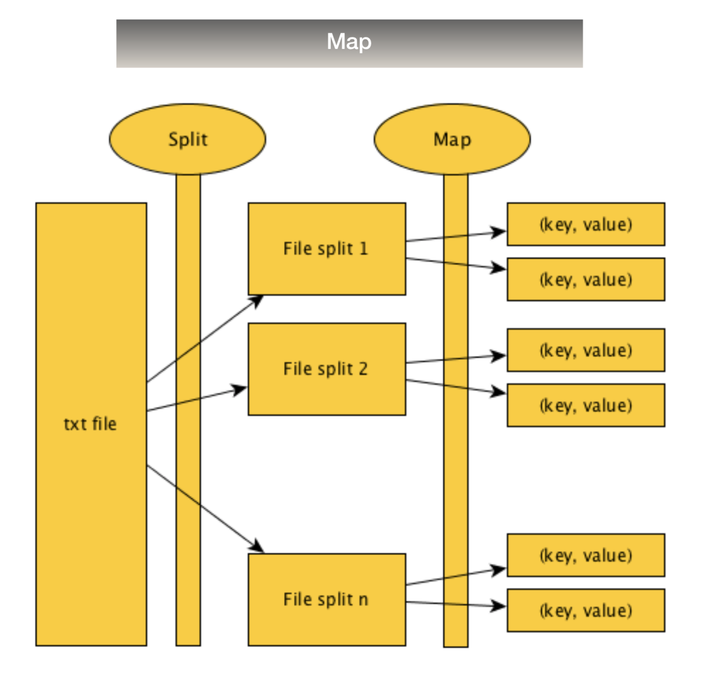
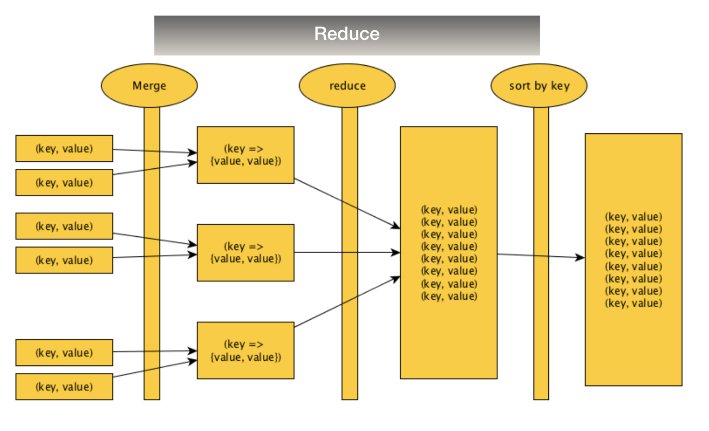

# MapReduce: Word Count

A program that counts how many times a word appears in a .txt file with efficiency and speed in mind. It can handle .txt files of various gigabytes. It uses a MapReduce structure without the use of external libraries.

## Purpose

We developed this program for the Software Architecture and Technologies subject for the Autonomous University of Barcelona (UAB) with the intention to learn the technologies and languages used.

## MapReduce algorithm

The algorithm that we implemented consists on two parts.

### Map

It reads a line from the input file and parses it in words. It gives the word a key and a value of one.



### Reduce

It counts every words and gives it a unique key and value, which results in the word with the sum of all the values so we can know how many times the word appears in the text.



## Usage

To use the program we use a Linux bash script so it can concatenate the analysis of various .txt files, which will be executed sequentially. To run the program you need to make sure that the folders "src", "bin" and "files" exists and that inside the "files" folder you have all the .txt files that you want to be checked. The bin files provided are needed, as per default the script does not compile the Java program. If you need to compile it again, un-comment lines 19 and 21 from the bash script. From the terminal you need to run:

```Bash
 sh WordCount.sh fileName1.txt fileName2.txt fileNameN.txt
 ```

 Where "fileNameX.txt is the name of the file or files that you want to inspect.

## Technologies used

* Java
* Bash

## Authors

* **[Rafael Díaz](https://github.com/palancana)**

  * Author and maintainer

* **[Mario Arias](https://github.com/Shooter9)**

  * Author and maintainer